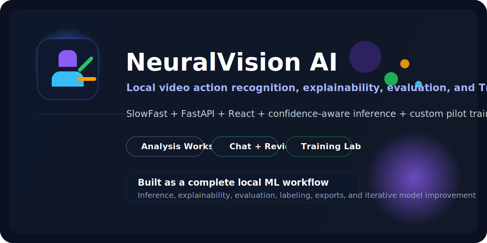
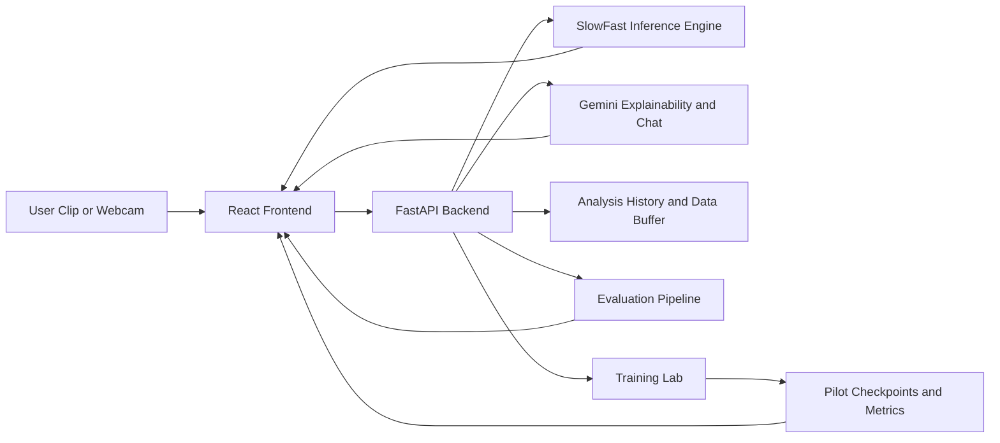

<div align="center">



# NeuralVision AI

### Local video action recognition platform with analysis, explainability, evaluation, and Training Lab workflows

[](requirements.txt)
[](main.py)
[](frontend/package.json)
[](inference.py)
[](#project-status)

**NeuralVision AI** is a local, full-stack ML application that analyzes short video clips, explains predictions, evaluates model quality, stores reviewable samples, and supports lightweight pilot training inside the same product.

[Overview](#overview) | [Features](#feature-set) | [Architecture](#system-architecture) | [Quick Start](#quick-start) | [Training Lab](#training-lab) | [API](#api-summary)

</div>

---

## Overview

This project is built as an end-to-end local AI workflow rather than a single-script demo.

- Upload a video or record a short webcam clip
- Run clip-level action recognition with pretrained SlowFast R50
- Return confidence-aware predictions with an `uncertain` fallback
- Generate optional Gemini-powered explanations and chat responses
- Save analysis history, review data, and evaluation reports locally
- Train and inspect a small pilot model through a dedicated Training Lab

## Feature Set

| Workspace | What it does |
| --- | --- |
| **Analysis** | Uploads or records clips, predicts actions, shows top-k results, confidence, and explanations |
| **Chat** | Supports chat-style interaction, saved sessions, rename/delete/export, and backend Gemini calls |
| **History & Review** | Stores recent analyses, creates thumbnails, and keeps clips available for later human review |
| **Evaluation** | Runs local benchmark-style evaluation from a labeled JSONL manifest |
| **Training Lab** | Trains a small five-class pilot model, tracks runs, metrics, logs, and checkpoint promotion |

## System Architecture



## Tech Stack

- **Backend:** FastAPI, Uvicorn, PyTorch, PyTorchVideo, OpenCV
- **Frontend:** React, Vite, CSS
- **Modeling:** SlowFast R50 for general inference, lightweight pilot classifier for Training Lab
- **Persistence:** local JSON/JSONL metadata and filesystem storage

## Repository Layout

```text
.
|-- main.py                         # FastAPI application and API routes
|-- inference.py                    # SlowFast inference and feature extraction
|-- training_lab.py                 # Pilot training manager and checkpoint flow
|-- evaluation.py                   # Evaluation pipeline
|-- data_buffer.py                  # Buffering and future-training data handling
|-- explainability.py               # Gemini explanation integration
|-- chat_service.py                 # Chat session persistence and helpers
|-- frontend/                       # React client
|-- configs/training/               # Training config scaffolds
|-- datasets/reviewed/              # Reviewed-dataset scaffold
|-- models/                         # Model registry metadata
`-- data/                           # Local runtime data, caches, exports, runs
```

## Quick Start

### 1. Verify the Python environment

```powershell
.\venv\Scripts\python.exe check_env.py
```

### 2. Start the backend

```powershell
.\venv\Scripts\python.exe main.py
```

### 3. Start the frontend

```powershell
cd frontend
npm run dev
```

Open the Vite URL shown in the terminal, usually `http://127.0.0.1:5173`.

## Configuration

Runtime settings are controlled through environment variables. Use [.env.example](.env.example) as the reference list.

Typical local startup:

```powershell
$env:GEMINI_API_KEY="your_key_here"
$env:CONFIDENCE_THRESHOLD="25"
$env:MAX_UPLOAD_MB="200"
.\venv\Scripts\python.exe main.py
```

Useful inference-related settings:

- `TARGET_CLIP_SECONDS`
- `MAX_SOURCE_SECONDS`
- `NORMALIZE_CONTAINER_FOR_INFERENCE`
- `TOP1_MIN_CONFIDENCE`
- `TOP1_TOP2_GAP_THRESHOLD`

## Typical Workflows

### Run Video Analysis
1. Start the backend and frontend
2. Open the Analysis workspace
3. Upload a clip or record a short webcam video
4. Inspect the prediction, confidence, and explanation

### Run Evaluation
1. Create `data/evaluation/manifest.jsonl`
2. Add one JSON object per line, for example:

```json
{"path":"data/evaluation/videos/sample_punch.mp4","label":"punch","notes":"optional"}
```

3. Run evaluation from the UI or with:

```powershell
.\venv\Scripts\python.exe evaluate_model.py
```

### Training Lab
1. Place clips into:
   - `data/training_lab/basic_actions_dataset/clap`
   - `data/training_lab/basic_actions_dataset/wave`
   - `data/training_lab/basic_actions_dataset/punch`
   - `data/training_lab/basic_actions_dataset/talk`
   - `data/training_lab/basic_actions_dataset/walk`
2. Keep at least 5 clips per class
3. Open **Training Lab** and launch a preset run
4. Review logs, metrics, and checkpoints
5. Promote a successful run only when you want it active in Analysis

## API Summary

<details>
<summary><strong>Expand API endpoints</strong></summary>

- `GET /health`
- `POST /upload-video`
- `GET /explanation`
- `GET /analysis/history`
- `GET /evaluation/latest`
- `POST /evaluation/run`
- `GET /models/current`
- `POST /models/current`
- `GET /training-lab/overview`
- `POST /training-runs/start`

</details>

## Current Scope

This project is strongest as a **clip-level action recognition system**. It predicts the dominant action in a short video clip. It is **not** a multi-person action detection system with bounding boxes and per-person labels.

The default production path uses a pretrained Kinetics-400 SlowFast model. Training Lab demonstrates how the project can evolve toward more specialized models over time.

## Demo Guidance

For the most reliable live demo, use clips with:

- one clear subject
- one obvious action
- stable framing
- good lighting
- minimal background clutter

Actions such as clapping, instrument playing, boxing motion, push-ups, and sports clips usually present better than noisy multi-person scenes.

## Notes on Accuracy

- The default model is broad, not domain-specific
- Low-confidence outputs are intentionally reported as `uncertain`
- The pilot model in Training Lab is useful for demonstrating iterative improvement, not as a guaranteed replacement for the pretrained model

## Project Status

NeuralVision AI is currently a polished local prototype with:

- working backend and frontend
- functional analysis workflow
- explainability and chat integration
- evaluation and review tooling
- a dedicated training workspace for pilot model development

The biggest future improvement is still the same: more reviewed data and stronger fine-tuned models.
